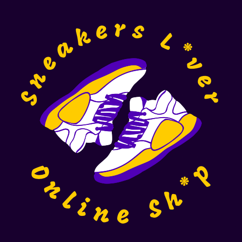

<!-- PROJECT LOGO -->
 

  

  <h3 align="center">Sneakers L*vers!</h3>

  

    An ReactJS e-commerce developed as Final project of React JS course!
     
    <a href="https://github.com/alexisburgos1/SneakersLovers"><strong>Explore the docs »</strong></a>
     
     
    <a href="https://sneakers-lover.vercel.app/">View Demo in Vercel</a>
    
  

<!-- TABLE OF CONTENTS -->

  
Table of Contents

  <ol>
    <li>
      <a href="#about-the-project">About The Project</a>
      <ul>
        <li><a href="#built-with">Built With</a></li>
      </ul>
    </li>
    <li><a href="#usage">Usage</a></li>
    <li><a href="#contact">Contact</a></li>
    <li><a href="#acknowledgments">Acknowledgments</a></li>
  </ol>

<!-- ABOUT THE PROJECT -->
## About The Project

Sneakers Lovers! is an ecommerce for all those customer who are looking to enjoy a shop with the newest products at sale.
This was being created in order to understand and apply all the techniques learned during the React js course from Corderhouse using  CSS framework and Firebase database. I've implemented components, promises, events, hooks, rounting & navegation.

### Built With

<a href="#readme-top">back to top</a>

<!-- USAGE EXAMPLES -->

<!-- CONTACT -->
## Contact

<strong>Alexis Burgos</strong> -  -  - alexisburgos001@gmail.com

Project Link: https://github.com/alexisburgos1/SneakersLovers

<a href="#readme-top">back to top</a>

<!-- ACKNOWLEDGMENTS -->
## Acknowledgments

* [Vercel](https://vercel.com/)
* [Boxicons](https://boxicons.com/)

<a href="#readme-top">back to top</a>

